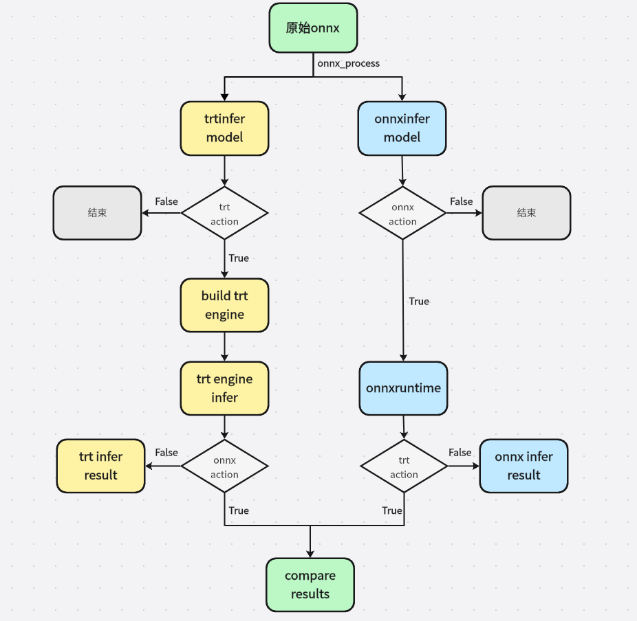

# Readme

polygraph_tools是比较onnx模型和编译的trt engine的数值精度，可以快速观测每个中间tensor的数值差异，从而定位可能出现数值异常的位置。

## 流程图



## 环境准备

1、安装tensorrt

webide地址：/proc_data/hqb/TensorRT-10.11.0.33

```
pip install /proc_data/hqb/TensorRT-10.11.0.33/python/tensorrt-10.11.0.33-cp38-none-linux_x86_64.whl
```

2、必要的库

```
onnx                          1.17.0
onnx_graphsurgeon             0.5.8
onnxruntime                   1.16.3
onnxruntime_extensions        0.13.0
onnxruntime-gpu               1.16.3
polygraphy                    0.49.0
```

3、修改env.sh对应地址

4、自定义算子库安装

```
cd ops/voxel/
python setup.py develop
cd ../
cd bev_pool_v2/
python setup.py develop
cd ../bevformer
chmod +x make.sh 
./make.sh 
```

## 快速使用

```
source env.sh
python compare.py config.yaml
```

## yaml 说明和示例

```
input_data_path: ./onnx_sample/BEV_OD_inputs.pt 
outputs: ["@group3", "@model_outputs", "/BEV_OD/head1/layers.0/Squeeze_2_output_0"] 
save_path: BEV_OD.onnx_trt_report.csv
```

- input_data_path
onnx模型所需输入数据路径，可接收dict格式的文件，也可以是文件夹，文件夹中保存输入的同名bin文件；
！注意：onnx模型输入输出的fp16格式会处理为fp32格式，注意做必要的数据格式转换

- outputs
列表格式，指定需要比较的tensor名称，有以下几种用法，也可以综合使用：
  - "@all": 比较模型所有tensor，除去Q/DQ节点的输出；
  - "@module_name": 指定module_name开头的所有tensor；
  - "@model_outputs": 指定模型输出；
  - "tensor_name": 指定比较的tensor_name；
  - []: 默认模型的原始输出；

- save_path：csv文件的保存路径，csv文件保存了tensor数值比较的结果


```
onnx:
  onnx_path: ./onnx_sample/BEV_OD.onnx 
  action: True  
```

- onnx_path: onnx模型的地址，必须有；
- action: 是否做onnx推理，True为推理，False为不推理；


```
trt:
  action: True 
  fp16: True
  fp32_layer_list: [] #["/BEV_OD/head1/layers.4/attn/MatMul_3"] 
  plugins: ["./trt_plugins/libinferplugin_x86_1029.so", "./trt_plugins/plugin_trt.so"]
  dynamic_shape: {} #{ranks_depth: [629294, 1258588, 5034352], ranks_feat: [629294, 1258588, 5034352], ranks_bev: [629294, 1258588, 5034352], interval_starts: [8507, 17014, 68056], interval_lengths: [8507, 17014, 68056]}
```

- action: 是否做trt推理，True为推理，False为不推理；
- fp16: 设置为True，以fp16精度执行trt编译推理；
- fp32_layer_list: 列表格式，指定特定层为fp32精度做trt编译推理；
- plugins: 列表格式，trt编译推理所需的自定义算子插件，支持多个插件；
- dynamic_shape: 字典格式，模型输入的动态shape信息，{input_name: [min_shape, opt_shape, max_shape]}


```
additional_operation:
  add_input_name_list: [] #["/Concat_1_output_0"]
  add_input_data_root: ./save_bin_root/onnxruntime_outputs
  save_name_list: [] #["/Concat_1_output_0"]  
  save_bin_root: ./save_bin_root 
```

- add_input_name_list
列表格式，需要添加为模型输入的tensor name列表，默认为空
- add_input_data_root
文件夹路径，保存添加的模型输入所需的bin文件，命名方式为tensor_name.tag_shape.*.*.*.float32.bin，暂时只支持fp32的tensor的添加；
- save_name_list: 列表格式，需要保存的输出名，保存名称为tensor_name.tag_shape.*.*.*.float32.bin，默认为空
- save_bin_root
保存输出的目录，onnxinfer和trt_infer分别保存在该文件夹下
  - onnxruntime_outputs: 保存onnxinfer输出的子文件夹
  - trtinfer_outputs: 保存trtinfer输出的子文件夹